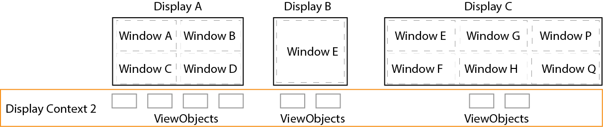

#Display

Display API enables remotely managing content on the displays driven by **[electron](http://electron.atom.io/) based [display-workers](https://github.ibm.com/celio/display-worker)**. 


`io.displayContext` is a singleton object in the CELIO library. It helps to create, activate and manipulate display contexts.

##Basics

Typically, an application has a single **display context**. However, an application can create and manage as many display contexts as needed.
 
### Default Setup
By default, a display context has a window per display (display-worker) as below. Here, the display names are used for window names and display bounds are used as the size of these windows. ViewObjects are created within these windows.


*Figure 1. Default window setup for a display context.*


### Advanced Setup
More advanced settings are available to define windows within each display worker in a display context.

*Figure 2. Advanced window setup for a display context.*


Example of advanced window settings:

```js
let window_settings = {
    "windowA" : {
        "displayName" : "displayA",
        "x" : 0,
        "y" : 0,
        "width" : 500,
        "height" : 500,
        "contentGrid" : {
            "row" : 2,
            "col" : 2,
            "padding" : 5
        },
        "fontSize" : "50px"
    },
    "windowP" : {
        "displayName" : "displayA",
        "x" : 501,
        "y" : 0,
        "width" : 500,
        "height" : 500,
        "contentGrid" : {
            "row" : 2,
            "col" : 2,
            "padding" : 5
        },
        "fontSize" : "50px"
    },
    "windowB" : {
        "displayName" : "displayB",
        "x" : 0,
        "y" : 0,
        "width" : 500,
        "height" : 500
    },
    "windowC" : {
        "displayName" : "displayC",
        "x" : 0,
        "y" : 0,
        "width" : 500,
        "height" : 500,
        "contentGrid" : {
            "row" : 2,
            "col" : 2,
            "padding" : 5
        }
    },
    ...

} 
```