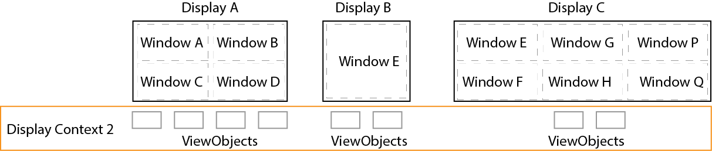
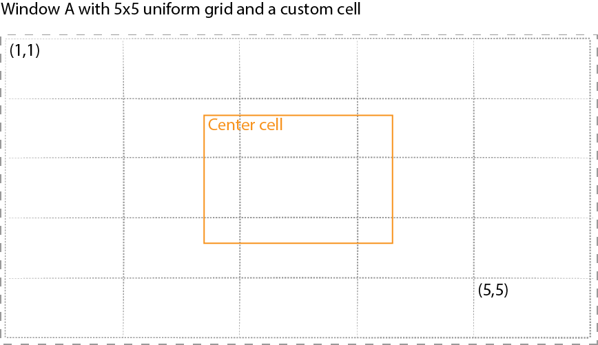

#Display

[Display APIs](https://pages.github.ibm.com/celio/CELIO/CELIO.html) enable remotely managing content on the displays driven by **[electron](http://electron.atom.io/) based [display-workers](https://github.ibm.com/celio/display-worker)**. 


##Basics

Typically, an application has a single **display context**. However, an application can create and manage as many display contexts as needed.

### Factory Object
[`io.displayContext`](displayfactory.md) is a factory object in the CELIO library. It helps to create, activate and manipulate display contexts. 


 
### Default Setup
By default, a display context has a window per display (display-worker) as below. Here, the display names are used for window names and display bounds are used as the size of these windows. ViewObjects are created within these windows.


*Figure 1. Default window setup for a display context.*


### Advanced Setup
More advanced settings are available to define windows within each display worker in a display context.

*Figure 2. Advanced window setup for a display context.*


Example of advanced window settings:

```js
let window_settings = {
    "windowA" : {
        "displayName" : "displayA",
        "x" : 0, "y" : 0, "width" : 500, "height" : 500,
        "contentGrid" : {
            "row" : 2,
            "col" : 2,
            "padding" : 5
        },
        "fontSize" : "50px"
    },
    "windowP" : {
        "displayName" : "displayA",
        "x" : 501, "y" : 0, "width" : 500, "height" : 500,
        "contentGrid" : {
            "row" : 2,
            "col" : 2,
            "padding" : 5
        },
        "fontSize" : "10px"
    },
    "windowB" : {
        "displayName" : "displayB",
        "x" : 0, "y" : 0, "width" : 500, "height" : 500
    },
    "windowC" : {
        "displayName" : "displayC",
        "x" : 0, "y" : 0, "width" : 500, "height" : 500,
        "contentGrid" : {
            "row" : 2,
            "col" : 2,
            "padding" : 5
        }
    },
    ...

} 
```

### ViewObjects placement in a window
There are a couple of notations to support placement of view objects

- **Pixels** : use raw pixels to size and position the viewObjects. You can use helper functions such as `DisplayObject.getWindowBounds()` and `io.displayContext.getDisplays()` to dynamically layout viewobjects.
- **Relative Size** : FontSize is setup at root of the document. This helps to specify size and position of view objects relative to the window's font size using `em`.The `fontSize` parameter within a window setting sets up the font size of the window.
- **Grid** : A window can have a simple grid layout. This layout helps to place content using cell position (row, column) instead of pixels. The `contentGrid` object within a window setting enables creation of the grid. In addition to placement of ViewObjects, the grid also support snapping these viewobjects to grid cells while dragging. Also, the viewobjects can be slided up, down, left and right in this grid. Further, custom cells can also be defined using `DisplayContext.getDisplayWindowSync('displayName').addToGrid(label, bounds, backgroundStyle)`

*Figure 3. A Sample grid with 5x5 uniform griding with a custom center cell.*


## API Reference

- [io.displayContext](displayfactory.md)
- [DisplayContext](displaycontext.md)
- [Window](window.md)
- [ViewObject](viewobject.md)